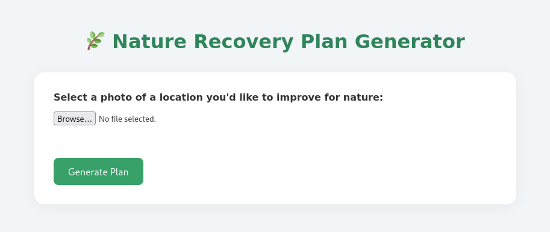

# 🌱 Coding4Climate Welcome to **Coding4Climate** 
 
I’ve built a web app that allows you to upload a photo of a location and receive direct, AI-generated tips on how to stimulate biodiversity in that specific area. 

 --- 

## 🚀 How to Use (Locally) 

Clone the repository and run the app with the following steps: 

### 1. Set up a virtual environment 
**Linux / macOS:** 

```bash python3 -m venv env source env/bin/activate ``` 

**Windows (CMD):** 

```cmd python -m venv env env\Scripts\activate ``` 

### 2. Install dependencies 

```bash pip install openai flask pillow ``` 

### 3. Clone the repo 

```bash git clone https://github.com/DDE-64-bit/Coding4Climate.git cd Coding4Climate/src ``` 

### 4. Run the app 

```bash python app.py ``` 
Now open your browser and go to [http://localhost:5000](http://localhost:5000) to try it out! --- 

## 🌍 What It Does 
Upload a photo of a place — a backyard, a field, a street — and the AI will analyze it and give you **concrete suggestions** to help nature reclaim the space and boost biodiversity. --- 

## 💡 Why? 
Small changes in our environment can have big impacts on local ecosystems. This tool helps make those changes more visible, accessible, and actionable. 

## 🤖 Powered by
 - GPT-4o via OpenAI or any local model from ollama
 - Flask (Python web framework) 
 - Pillow (image handling) 
 - Custom agent logic (full AI agent SDK coming soon!)
